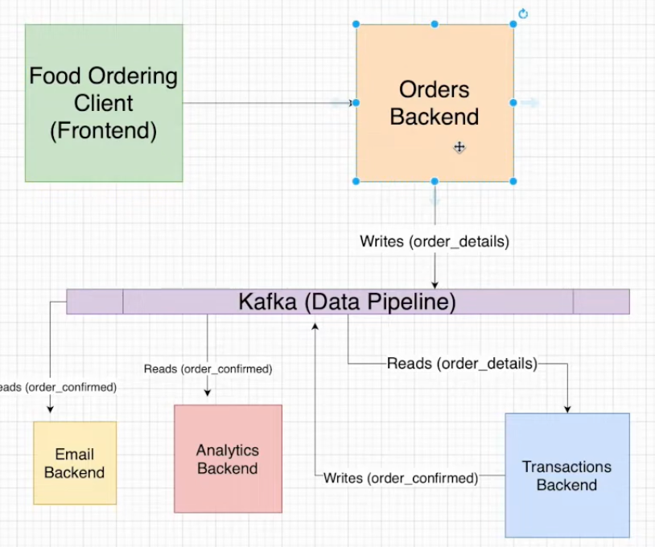

([link here](https://www.youtube.com/watch?v=qi7uR3ItaOY&ab_channel=CodewithIrtiza))

This is a project about how to build a scalable and decoupled backend for an application using Apache Kafka and Python. It's not really matter what this app is (a food ordering app in this case), but it's more about the system that we want to build and how it can scale very easily.

I will build the whole system locally using a locally running Kafka broker, but of course in a production setting you will want to run multiple Kafka instances ina more mature environment.
