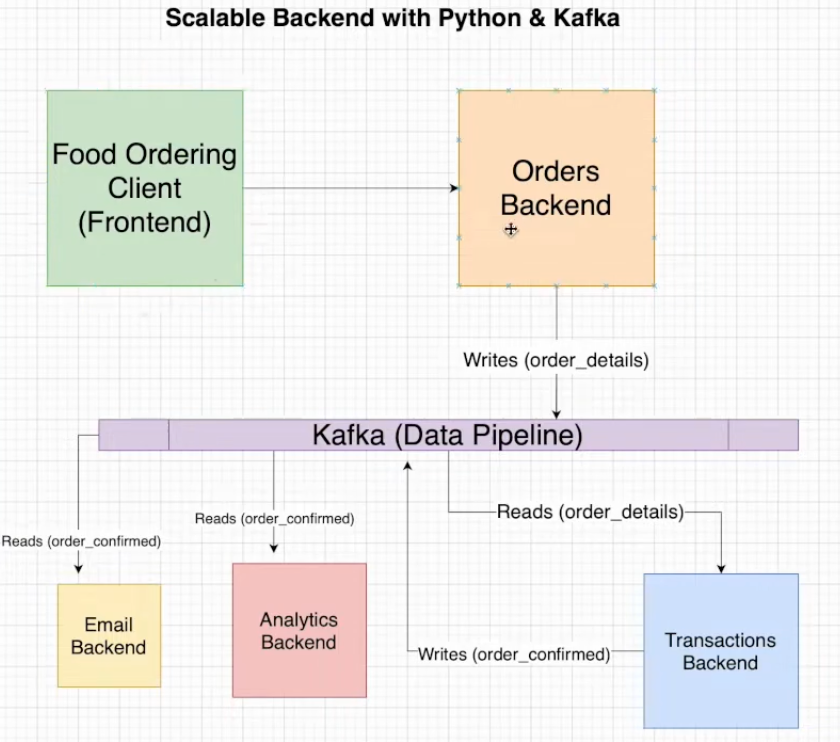

# Repo Introduction
This repo is my attempt to recreate a project I found on YouTube ([link here](https://www.youtube.com/watch?v=qi7uR3ItaOY&ab_channel=CodewithIrtiza)) by "Code with Irtiza" that explains how to use Apache Kafka for a simple project. My plan is to start by copying that project and then add more features, like a database, to make the application do more things.

# Project Details
This is a project about how to build a scalable and decoupled backend for an application using Apache Kafka and Python. It's not really matter what this app is (a food ordering app in this case), but it's more about the system that we want to build and how it can scale very easily.

I will build the whole system locally using a locally running Kafka broker, but of course in a production setting you will want to run multiple Kafka instances ina more mature environment.

# Application System Diagram


# Getting Started
1. Clone this repository:
```
https://github.com/simdangelo/food-ordering-app.git
```
2. Create a virtual environment and install the requirements with `requirements.txt` file (this project is proven to work with Python 3.10):
```
pip install -r requirements.txt
```
3. Navigate to the project directory and spin up the Docker containers through `docker-compose.yml` file (install Docker if you don't have it yet):
```
docker-compose up
```
4. Wait for the containers to be up and running. Then open 4 terminals and run each of the following commands in each terminal (run python `order_backend.py` as the last one):
```
python analytics.py
```
```
python email.py
```
```
python transactions.py
```
```
python order_backend.py
```

# Results
After starting the first 3 terminals, and the fourth one as last one, you should see the following outputs:


As you can see in the image above, as orders are being created in the bottom right terminal, the other three terminals are populated with info about:
* order confirmation with an email sent to the customer (upper left terminal);
* details about the specific order (upper right terminal);
* total number of orders and cumulative revenue (bottom left terminal).

# What's Next
I want to add some feature so this project in order to makes it more technically challenging and more interesting. I'm thinking about: 
* add a database to store the orders and the customers' information.
* add a frontend to the application so that users can make detailed order.
